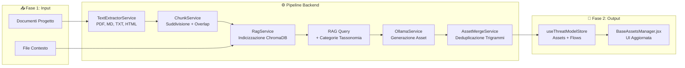
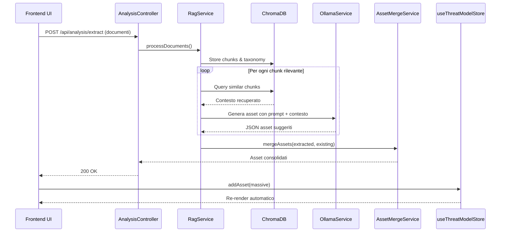

# Pipeline AI ed Estrazione Asset

## Panoramica del Flusso di Estrazione (Fase 1)
Il processo trasforma documenti grezzi in asset strutturati pronti per il threat modeling, integrando RAG e LLM locale.

## Sequenza di Interazione (Dettagliata)

## Componenti Chiave della Pipeline
| Servizio | File | Responsabilità |
|----------|------|----------------|
| `TextExtractorService` | `backend/services/textExtractorService.js` | Estrae testo da PDF, MD, TXT, HTML |
| `ChunkService` | `backend/services/chunkService.js` | Suddivide il testo in chunk con overlap configurabile |
| `RagService` | `backend/services/ragService.js` | Bridge verso ChromaDB (Python o HTTP), indicizzazione, query |
| `OllamaService` | `backend/services/ollamaService.js` | Chiamate a Ollama con timeout e gestione errori |
| `AssetMergeService` | `backend/services/assetMergeService.js` | Deduplicazione per similarità trigrammi + unione metadati |
| `AssetExtractionPipeline` | `backend/services/assetExtractionPipeline.js` | Orchestratore: coordina tutti i servizi in sequenza |

## Note di Configurazione
- **ChromaDB**: Collezione `methodology_dfd_base` per Fase 1. Ogni metodologia avanzata usa `methodology_{id}`.
- **Prompt**: Definiti in `backend/methodologies/manifest.json`, arricchiti dinamicamente con contesto RAG.
- **Fallback**: Se Ollama è irraggiungibile, la pipeline restituisce errore controllato senza crashare il backend.

> 📌 **Manutenzione**: Aggiornare questo diagramma quando si modifica il flusso di estrazione, si aggiungono nuovi formati documenti, o si cambia la logica di merging/RAG.