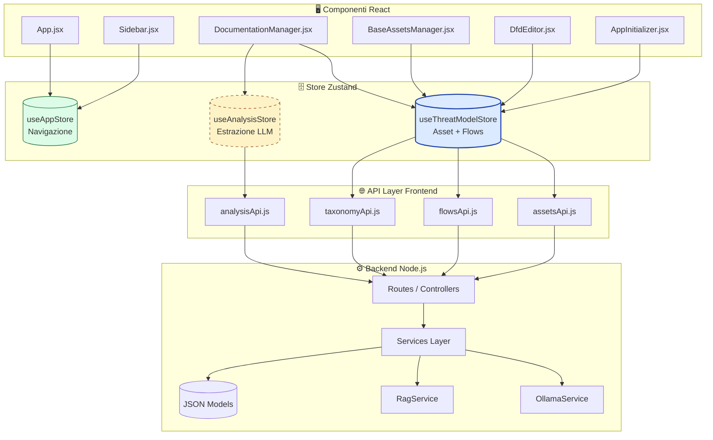

# Architettura Store Zustand

## Panoramica
Il frontend gestisce lo stato globale tramite tre store specializzati, ciascuno con un dominio e un ciclo di vita distinti.



## useThreatModelStore (Principale)
- **Tipo**: Persistente (unica fonte di verità per il modello)
- **Responsabilità**: CRUD asset/flussi, flag `assetsLoaded`/`flowsLoaded`, sincronizzazione con backend
- **Componenti**: `BaseAssetsManager`, `DfdEditor`, `DocumentationManager`, `AppInitializer`
- **Flusso aggiornamento**:
  1. Componente chiama azione store (es. `deleteAsset`)
  2. Store chiama API → Backend → Aggiorna JSON/DB
  3. Store aggiorna stato locale
  4. Zustand triggera re-render automatico in tutti i componenti sottoscritti

## useAppStore (Navigazione)
- **Tipo**: Persistente (sessione utente)
- **Responsabilità**: `currentPhase` (1-5), stato sidebar
- **Componenti**: `App`, `Sidebar`
- **Nota**: Nessun dato di dominio, solo routing UI

## useAnalysisStore (Estrazione LLM)
- **Tipo**: Transitorio (viene resettato dopo ogni estrazione)
- **Responsabilità**: Progresso estrazione, chunk in elaborazione, errori LLM temporanei
- **Componenti**: `DocumentationManager` (solo durante Fase 1)
- **Nota**: I risultati finali vengono scritti in `useThreatModelStore`, non rimangono qui

## Best Practice per i Componenti
```javascript
// ✅ Selector stabili (uno per valore)
const assets = useThreatModelStore(state => state.assets);
const deleteAsset = useThreatModelStore(state => state.deleteAsset);

// ✅ Aggregazione sicura con useShallow
import { useShallow } from 'zustand/shallow';
const { assets, deleteAsset } = useThreatModelStore(
  useShallow(state => ({ assets: state.assets, deleteAsset: state.deleteAsset }))
);

// ❌ DA EVITARE (crea oggetto nuovo ad ogni render → infinite loop)
const { assets, deleteAsset } = useThreatModelStore(state => ({
  assets: state.assets,
  deleteAsset: state.deleteAsset
}));
```

> 📌 **Manutenzione**: Aggiornare questo diagramma ogni volta che un nuovo componente viene collegato a uno store o quando cambia la struttura degli API layer.