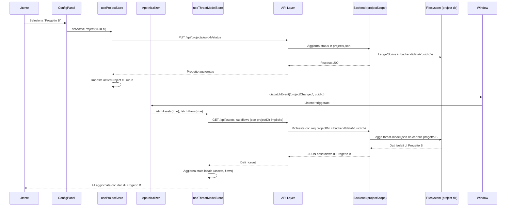

# Architettura Store – Frontend React

> **Ultimo aggiornamento**: 31 maggio 2025  
> **Versione**: 2.1  
> **Stato**: ✅ Completo con gestione progetti e isolamento dati

---

## Panoramica

Il frontend gestisce lo stato globale tramite **quattro store specializzati**, ciascuno con un dominio e un ciclo di vita distinti.

```mermaid
flowchart TD
 subgraph UI["🖥️ Componenti React"]
 App[App.jsx]
 Sidebar[Sidebar.jsx]
 ConfigPanel[ConfigPanel.jsx]
 DocMgr[DocumentationManager.jsx]
 BaseMgr[BaseAssetsManager.jsx]
 DfdEd[DfdEditor.jsx]
 Init[AppInitializer.jsx]
 end

 subgraph Stores["🗄️ Store Zustand"]
 ThreatStore[("useThreatModelStore\n\nAsset + Flows")]:::main
 AppStore[("useAppStore\n\nNavigazione")]:::nav
 ProjectStore[("useProjectStore\n\nGestione Progetti")]:::proj
 AnalysisStore[("useAnalysisStore\n\nEstrazione LLM")]:::temp
 end

 subgraph API["🌐 API Layer Frontend"]
 AssetsApi[assetsApi.js]
 FlowsApi[flowsApi.js]
 ProjectsApi[projectsApi.js]
 TaxonomyApi[taxonomyApi.js]
 AnalysisApi[analysisApi.js]
 end

 subgraph Backend["⚙️ Backend Node.js"]
 Routes[Routes / Controllers]
 Services[Services Layer]
 ProjectScope[Middleware: projectScope]
 Ollama[OllamaService]
 RAG[RagService]
 JSON[(JSON Models per progetto)]
 end

 %% UI -> Stores
 App --> AppStore
 Sidebar --> AppStore
 ConfigPanel --> ProjectStore
 Init --> ThreatStore
 Init --> ProjectStore
 DocMgr --> ThreatStore
 DocMgr --> AnalysisStore
 BaseMgr --> ThreatStore
 DfdEd --> ThreatStore

 %% Stores -> API
 ThreatStore --> AssetsApi
 ThreatStore --> FlowsApi
 ThreatStore --> TaxonomyApi
 ProjectStore --> ProjectsApi
 AnalysisStore --> AnalysisApi

 %% API -> Backend
 AssetsApi & FlowsApi & TaxonomyApi --> Routes
 ProjectsApi --> Routes
 AnalysisApi --> Routes
 Routes --> Services
 Services --> ProjectScope
 ProjectScope --> Ollama & RAG & JSON

 %% Eventi custom
 ProjectStore -.->|dispatch projectChanged| Init
 Init -.->|fetchAssets(true)| ThreatStore

 classDef main fill:#dbeafe,stroke:#1e40af,stroke-width:2px
 classDef nav fill:#dcfce7,stroke:#166534
 classDef proj fill:#e0e7ff,stroke:#3730a3,stroke-width:2px
 classDef temp fill:#fef3c7,stroke:#92400e,stroke-dasharray:5 5
```

---

## useProjectStore (Nuovo – Gestione Progetti)

- **Tipo**: Persistente (sessione utente)
- **File**: `frontend/src/store/useProjectStore.js`
- **Responsabilità**:
  - Lista progetti (`projects`) con metadati (id, name, status, owner)
  - Progetto attivo (`activeProject`) con stato `draft` | `active` | `archived`
  - CRUD progetti: `fetchProjects()`, `addProject()`, `updateProject()`, `setActiveProject()`
  - Dispatch evento custom `projectChanged` quando il progetto attivo cambia
- **Componenti**: `ConfigPanel` (tab Progetto), `AppInitializer` (ascolta evento)
- **Flusso cambio progetto**:
  1. Utente seleziona progetto in `ConfigPanel`
  2. `setActiveProject(id)` chiama API → aggiorna stato store
  3. Store dispatcha evento custom `new CustomEvent('projectChanged', { detail: projectId })`
  4. `AppInitializer` ascolta l'evento e chiama `fetchAssets(true)` + `fetchFlows(true)`
  5. `useThreatModelStore` ricarica i dati dal backend per il nuovo progetto
- **Isolamento dati**: Ogni progetto ha la sua directory in `backend/data/<uuid>/` con `threat-model.json` isolato

```javascript
// Esempio: ascolto evento in AppInitializer.jsx
useEffect(() => {
  const handleProjectChanged = (e) => {
    // Forza reload dei dati per il nuovo progetto
    fetchAssets(true);
    fetchFlows(true);
  };
  
  window.addEventListener('projectChanged', handleProjectChanged);
  return () => window.removeEventListener('projectChanged', handleProjectChanged);
}, [fetchAssets, fetchFlows]);
```

---

## useThreatModelStore (Principale – Aggiornato)

- **Tipo**: Persistente (unica fonte di verità per il modello)
- **File**: `frontend/src/store/useThreatModelStore.js`
- **Responsabilità**:
  - CRUD asset/flussi con supporto `projectDir` (isolamento per progetto)
  - Flag `assetsLoaded`/`flowsLoaded` per prevenire fetch duplicati
  - Azioni con parametro `force: boolean` per forzare il ricaricamento (usato al cambio progetto)
  - Cascade delete locale: eliminando un asset, rimuove anche i flussi orfani dallo stato
- **Componenti**: `BaseAssetsManager`, `DfdEditor`, `DocumentationManager`, `AppInitializer`
- **Flusso aggiornamento**:
  1. Componente chiama azione store (es. `deleteAsset(id)`)
  2. Store chiama API con `projectDir` → Backend → Aggiorna JSON del progetto attivo
  3. Store aggiorna stato locale (con cascade delete per flussi orfani)
  4. Zustand triggera re-render automatico in tutti i componenti sottoscritti
- **Supporto isolamento**:
  - Tutte le API (`assetsApi`, `flowsApi`) includono automaticamente il contesto del progetto attivo
  - Il backend risolve `req.projectDir` tramite middleware `projectScope`

```javascript
// Esempio: fetch con force reload al cambio progetto
const fetchAssets = async (force = false) => {
  const { assetsLoaded, loading } = get();
  if ((assetsLoaded || loading) && !force) return;
  
  set({ loading: true, error: null });
  try {
    const data = await assetsApi.getAll(); // API usa projectDir implicito
    set({ assets: data, assetsLoaded: true, loading: false });
  } catch (error) {
    set({ error: error.message, loading: false, assetsLoaded: false });
  }
};
```

---

## useAppStore (Navigazione)

- **Tipo**: Persistente (sessione utente)
- **File**: `frontend/src/store/useAppStore.js`
- **Responsabilità**:
  - `currentPhase` (1-5): Fase corrente della wizard (Config → Docs → Assets → DFD → Report)
  - Stato sidebar: espansa/collassata
- **Componenti**: `App`, `Sidebar`
- **Nota**: Nessun dato di dominio, solo routing UI. Non interagisce con `useProjectStore`.

---

## useAnalysisStore (Estrazione LLM)

- **Tipo**: Transitorio (viene resettato dopo ogni estrazione)
- **File**: `frontend/src/store/useAnalysisStore.js`
- **Responsabilità**:
  - Progresso estrazione: `status` (idle | running | done | error), `currentChunk`, `totalChunks`
  - Errori temporanei LLM: messaggi di fallback se Ollama non risponde
  - Risultati grezzi: asset estratti prima del merge (non persistono)
- **Componenti**: `DocumentationManager` (solo durante Fase 1)
- **Nota**: I risultati finali vengono scritti in `useThreatModelStore` tramite `importAssets()`, non rimangono qui. Lo store viene resettato dopo ogni estrazione.

---

## Pattern di Inizializzazione – AppInitializer

- **File**: `frontend/src/components/AppInitializer.jsx`
- **Responsabilità**:
  - Fetch iniziale di asset/flussi al mount dell'app
  - Ascolto evento `projectChanged` per reload dati al cambio progetto
  - Gestione stato di caricamento globale (`loading` spinner)
- **Flusso**:
  1. Montato in `App.jsx` come primo child (prima di qualsiasi componente UI)
  2. Esegue `fetchAssets()` e `fetchFlows()` al mount (senza `force`)
  3. Registra listener per `projectChanged` → chiama `fetchAssets(true)` + `fetchFlows(true)`
  4. Non renderizza UI, solo effetti collaterali (`useEffect`)

```jsx
// AppInitializer.jsx – schema semplificato
export default function AppInitializer() {
  const { fetchAssets, fetchFlows } = useThreatModelStore(useShallow(s => ({
    fetchAssets: s.fetchAssets,
    fetchFlows: s.fetchFlows
  })));
  
  // Fetch iniziale
  useEffect(() => {
    fetchAssets();
    fetchFlows();
  }, [fetchAssets, fetchFlows]);
  
  // Listener cambio progetto
  useEffect(() => {
    const handler = () => {
      fetchAssets(true); // Forza reload
      fetchFlows(true);
    };
    window.addEventListener('projectChanged', handler);
    return () => window.removeEventListener('projectChanged', handler);
  }, [fetchAssets, fetchFlows]);
  
  return null; // Nessun UI
}
```

---

## Isolamento Dati per Progetto – Flusso End-to-End



**Punti chiave**:

1. **Nessun dato condiviso**: Ogni progetto ha la sua cartella `backend/data/<uuid>/` con `threat-model.json` isolato
2. **Middleware `projectScope`**: Risolve `req.projectDir` a ogni richiesta, leggendo il progetto attivo da `projects.json`
3. **Evento `projectChanged`**: Meccanismo leggero per notificare il cambio senza accoppiamento diretto tra store
4. **Force reload**: `fetchAssets(true)` bypassa i flag `assetsLoaded` per garantire dati freschi al cambio progetto

---

## Best Practice per Nuovi Store

1. **Unica fonte di verità**: Ogni dominio dati ha un solo store (es. asset/flussi → `useThreatModelStore`)
2. **Selector stabili**: Usa `useShallow` da `zustand/shallow` per aggregare valori senza causare re-render inutili
3. **API Layer dedicato**: Store e componenti chiamano sempre `src/api/*.js`, mai `fetch`/`axios` inline
4. **Isolamento progetti**: Se un nuovo store gestisce dati per-progetto, deve supportare `projectDir` come parametro opzionale
5. **Eventi custom**: Per notifiche cross-store, usa `CustomEvent` con namespace chiaro (es. `projectChanged`, non `dataUpdated`)

---

## Riferimenti

| Risorsa | Percorso |
|---------|----------|
| useProjectStore | `frontend/src/store/useProjectStore.js` |
| useThreatModelStore | `frontend/src/store/useThreatModelStore.js` |
| AppInitializer | `frontend/src/components/AppInitializer.jsx` |
| projectScope middleware | `backend/middleware/projectScope.js` |
| projectService | `backend/services/projectService.js` |
| API Layer progetti | `frontend/src/api/projectsApi.js` |